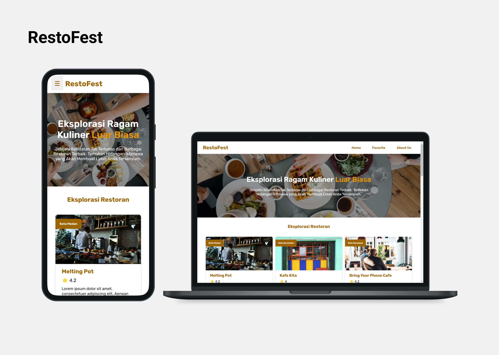

# RestoFest

RestoFest app is created as part of the 'Expert FE' course on Dicoding. It allows users to browse and discover information about restaurants provided by Dicoding's Restaurant API.

## Features
- Browse and search for restaurants.
- View detailed information about a restaurant, including its name, description, location, categories, menu items, rating, and customer reviews.
- Add and remove restaurants from your favorites list.
- Submit reviews for restaurants.

## Technologies Used
- Progressive Web App
- IndexedDB
- Webpack
- Workbox (Service Worker)
- Sass (SCSS)
- Jest (Unit Testing)
- CodeceptJS (End-to-End Testing)
- ESLint (Code Quality)

## Snapshot
